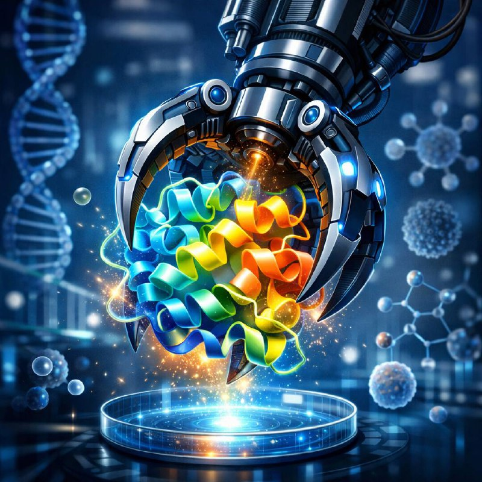

# 🧬 ProteinClaw

<p align="center">
  
</p>

**Conversational protein design — from target to validated binder candidates, all through natural language.**

ProteinClaw integrates a full computational protein design pipeline into the [OpenClaw](https://github.com/openclaw/openclaw) agent framework. Researchers can design protein binders, run structure predictions, score candidates, and assess stability — all by chatting with an AI assistant.

Built for the [OpenClaw](https://openclaw.ai) agent platform with skills inspired by [BioClaw](https://github.com/Runchuan-BU/BioClaw).

---

## ✨ What You Can Do

- **Structure Retrieval** — Fetch high-quality structures from PDB/UniProt with automatic quality filtering
- **Binder Generation** — Design peptide binders using BoltzGen diffusion model (all-atom, side-chain aware)
- **Complex Scoring** — Fast interface scoring with Boltz-2: interface pLDDT, buried surface area, ipTM, PAE
- **Monomer Stability** — Assess folding quality with Chai-1 and Boltz-2 refolds (pLDDT, disorder analysis)
- **BindCraft Integration** — Local GPU-accelerated binder optimization with PyRosetta scoring
- **Full Campaign Management** — Multi-stage design campaigns with automatic candidate tracking

---

## 🗂️ Repository Structure

```
ProteinClaw/
├── README.md
├── skills/                          # OpenClaw skill definitions
│   ├── SKILL.md                     # Hub router (entry point)
│   ├── binder-design/               # End-to-end binder design workflow
│   ├── boltzgen/                    # BoltzGen diffusion-based design
│   ├── boltz/                       # Boltz-2 structure prediction & scoring
│   ├── chai/                        # Chai-1 structure prediction
│   ├── bindcraft/                   # BindCraft local binder optimization
│   ├── proteinmpnn/                 # ProteinMPNN sequence design
│   ├── ligandmpnn/                  # LigandMPNN for small molecule binders
│   ├── solublempnn/                 # SolubleMPNN for solubility-optimized design
│   ├── esm/                         # ESM embeddings & language model tools
│   ├── foldseek/                    # Structure similarity search
│   ├── iggm/                        # IgGM antibody design
│   ├── ipsae/                       # ipSAE interface scoring
│   ├── mber/                        # MBER binding energy refinement
│   ├── pdb/                         # PDB structure queries
│   ├── uniprot/                     # UniProt sequence queries
│   ├── protenix/                    # Protenix structure prediction
│   ├── protein-design-workflow/     # Multi-stage campaign orchestration
│   ├── protein-qc/                  # Structure quality control
│   ├── campaign-manager/            # Design campaign tracking
│   ├── cell-free-expression/        # Cell-free expression assessment
│   ├── binding-characterization/    # Binding affinity characterization
│   └── setup/                       # Environment setup & Modal deployment
│
└── scripts/                         # Production pipeline scripts
    ├── rbx1_boltzgen_batch1.py      # Stage 2: BoltzGen batch generation
    ├── stage3_boltz_scoring.py      # Stage 3: Interface scoring (Boltz-2)
    ├── stage3_final.py              # Stage 3: Final filtered output
    ├── stage4_free.py               # Stage 4: Free monomer stability (Boltz-2)
    ├── stage4_chai_monomer.py       # Stage 4: Chai-1 monomer stability
    ├── stage4_plan_b.py             # Stage 4: Plan B batch Chai-1 runs
    ├── modal_chai1.py               # Modal cloud runner for Chai-1
    └── modal_pdb2png.py             # PDB structure visualization
```

---

## 🚀 Design Pipeline

ProteinClaw implements a 5-stage protein binder design pipeline:

```
Stage 1: Structure Acquisition
    └── Fetch target from PDB/AlphaFold DB, quality filter (resolution, coverage)

Stage 2: Binder Generation  
    └── BoltzGen diffusion → 500+ binder candidates (configurable length range)

Stage 3: Fast Scoring & Filtering
    └── Boltz-2 scoring → interface pLDDT ≥ 75, buried surface area ≥ 600 Ų
    └── Output: Top 250 candidates

Stage 4: Monomer Stability
    └── Chai-1 or Boltz-2 refold → pLDDT ≥ 75, disorder < 10%
    └── Output: Top 10–20 validated candidates

Stage 5: Experimental Prioritization
    └── MD simulations, BindCraft optimization, ranking for synthesis
```

### Example: RBX1 Peptide Binder Design

| Stage | Tool | Input | Output | Cost |
|-------|------|-------|--------|------|
| 1 | PDB query | UniProt P62877 | 3DPL chain B (2.60 Å) | free |
| 2 | BoltzGen | RBX1 structure | 500 binder candidates | ~$2.00 |
| 3 | Boltz-2 scoring | 500 candidates | Top 250 scored | ~$1.50 |
| 4 | Chai-1 | Top 8 candidates | 5 validated binders | ~$0.56 |

**Top results:**
- `rbx1_binder_144`: pLDDT=95.9, ipTM=0.743, 24 H-bonds, 102aa
- `rbx1_binder_197`: pLDDT=92.5, ipTM=0.720, 25 H-bonds, 106aa  
- `rbx1_binder_323`: pLDDT=91.1, ipTM=0.719, 23 H-bonds, 135aa

---

## ⚙️ Setup

### Prerequisites

- [OpenClaw](https://openclaw.ai) agent framework
- [Modal](https://modal.com) account (for cloud GPU compute)
- Python 3.10+

### Install Skills

```bash
# Clone into your OpenClaw skills directory
git clone https://github.com/junior1p/ProteinClaw.git ~/.openclaw/skills/protein-design

# Or copy individual skills
cp -r ProteinClaw/skills/* ~/.openclaw/skills/
```

### Configure Modal

```bash
# Install Modal client
pip install modal

# Authenticate
modal setup

# Deploy endpoints (see skills/setup/SKILL.md for details)
```


---

## 🧠 Skills System

Each subdirectory in `skills/` contains a `SKILL.md` that teaches the OpenClaw agent how to use that tool. The top-level `skills/SKILL.md` acts as a router, automatically selecting the right tool based on your natural language request.

**Example queries:**
- *"Find me the best RBX1 structure for binder design"* → `pdb` skill
- *"Design 500 peptide binders for this target"* → `boltzgen` skill  
- *"Score the top candidates for interface quality"* → `boltz` skill
- *"Check monomer stability of my top 8 designs"* → `chai` skill

---

## 📦 Modal Endpoints

| Endpoint | Model | GPU | Use Case |
|----------|-------|-----|----------|
| `boltzgen-protein-design` | BoltzGen | A100 | Binder generation |
| `boltz-structure-prediction` | Boltz-2 | A100 | Structure prediction & scoring |
| `chai1-structure-prediction` | Chai-1 | A100 | Complex & monomer prediction |
| `pdb2png-viewer` | PyMOL | CPU | Structure visualization |

---

## 📄 License

MIT License — see [LICENSE](LICENSE) for details.

---

## 🙏 Acknowledgments

- [BoltzGen](https://github.com/jwohlwend/boltz) — all-atom protein design
- [Chai-1](https://github.com/chaidiscovery/chai-lab) — molecular structure prediction
- [BioClaw](https://github.com/Runchuan-BU/BioClaw) — inspiration for the conversational biology agent pattern
- [OpenClaw](https://openclaw.ai) — agent framework
